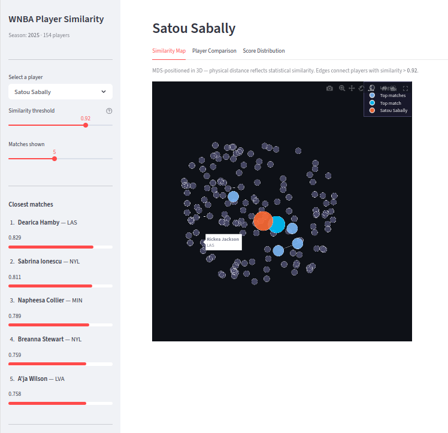
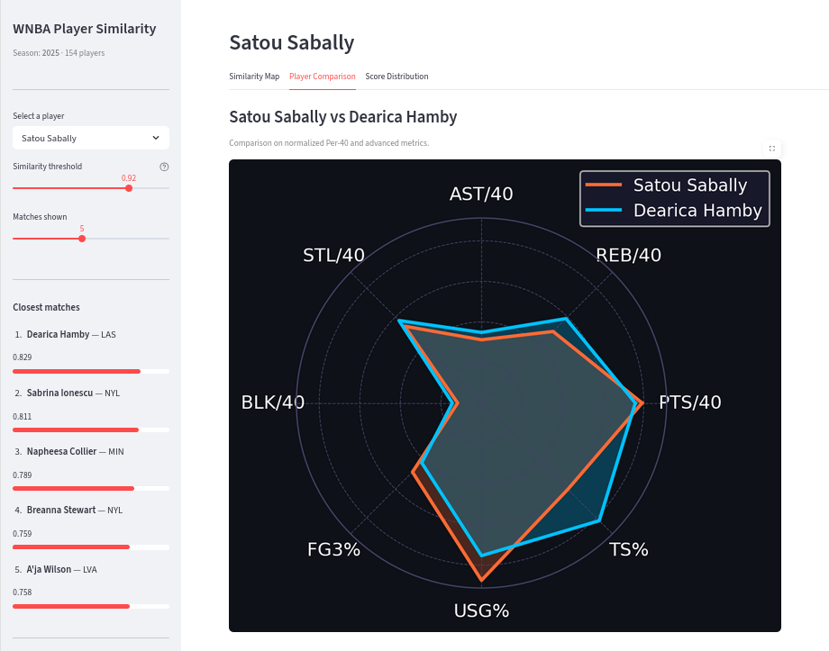
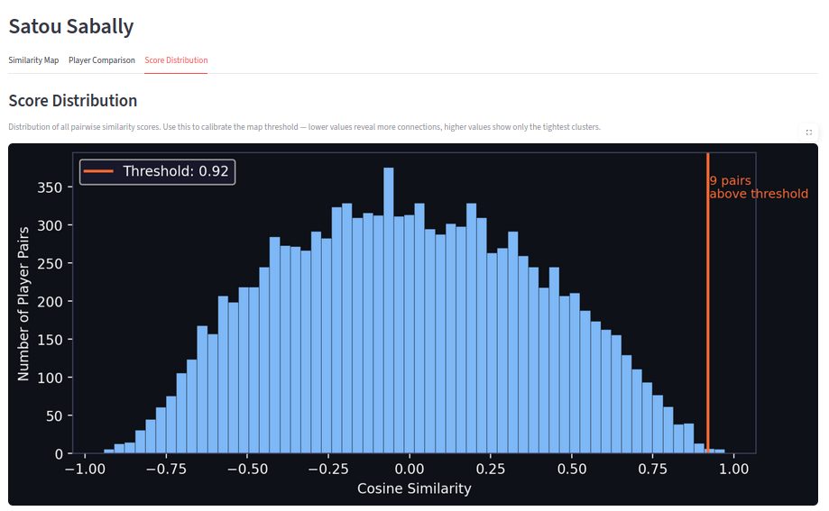

# WNBA Player Similarity Engine

A Python tool for finding statistical twins among WNBA players. I built this because the Phoenix Mercury just lost Satou Sabally and I'm curious to know what other "similar" players are out there. 

Similarity scores are fairly simple for this first take - I've pulled basic stats from the NBA-API, z-scored and weighted each stat, and then create a cosine similarity matrix for each pairwise player.

## Features

- **Similarity Map** — MDS-positioned interactive 3D graph where physical distance directly reflects statistical similarity. Edges appear between players above a configurable similarity threshold.
- **Player Comparison** — Spider chart comparing a selected player against their closest match across Per-40 and advanced metrics.
- **Score Distribution** — Histogram of all pairwise similarity scores with a live threshold line, so you can calibrate the map with data rather than guesswork.
- **Persistent match list** — Ranked closest matches always visible in the sidebar regardless of which tab is active.

## Screenshots

**Similarity Map**


**Player Comparison**


**Score Distribution**


## Quickstart

```bash
# 1. Clone and enter the project
git clone <repo-url>
cd wnba-player-similarity

# 2. Create and activate a virtual environment
python3 -m venv .venv
source .venv/bin/activate  # Windows: .venv\Scripts\activate

# 3. Install dependencies
pip install -r requirements.txt

# 4. Pull player data from nba_api (cached to data/raw/ after first run)
python -m src.data_fetch

# 5. Build the similarity matrix
python -m src.processor

# 6. Launch the app
streamlit run app.py
```

The app will be available at `http://localhost:8501`.

To force a fresh data pull (e.g. for a new season):
```bash
python -m src.data_fetch --refresh
python -m src.processor
```

## Configuration

All key settings live in `config.yaml`:

| Key | Default | Description |
| :--- | :--- | :--- |
| `data.season` | `"2025"` | WNBA season year (single-year format) |
| `data.min_minutes` | `100` | Minimum minutes played to be included in the matrix |
| `data.drop_rookies` | `false` | Exclude players with 0 years of experience. Set to `true` early in a new season when rookies have tiny sample sizes |
| `model.sim_threshold` | `0.92` | Default edge threshold for the galaxy map (also adjustable via slider) |
| `model.neighbors_count` | `5` | Default number of top matches shown |
| `weights.*` | `1.0` | Per-feature multipliers applied before scaling. Increase a weight to emphasize that trait in similarity results. A commented-out point-forward profile is included as an example. |

## Data Sources

All data is pulled from `nba_api` using `league_id="10"` (WNBA). Three endpoints are merged on `PLAYER_ID`:

| Endpoint | Data |
| :--- | :--- |
| `LeagueDashPlayerStats` (Totals) | GP, MIN, PTS, REB, AST, STL, BLK, TOV, FG3_PCT |
| `LeagueDashPlayerBioStats` | Height, Draft year (used to derive WNBA experience) |
| `LeagueDashPlayerStats` (Advanced) | USG_PCT, TS_PCT, PIE |

Counting stats are converted to a **Per-40 minutes** basis before similarity is computed. All features are then Z-score scaled and optionally weighted before cosine similarity is applied.

## Project Structure

```
wnba-player-similarity/
├── app.py              # Streamlit frontend (galaxy map, radar, distribution)
├── config.yaml         # Season, weights, thresholds, and file paths
├── requirements.txt    # Python dependencies
├── AGENT.md            # Project blueprint and column reference
├── data/
│   ├── img/            # Screenshots for README
│   ├── raw/            # Cached API output (git-ignored)
│   └── processed/      # Similarity matrix pickle (git-ignored)
├── src/
│   ├── data_fetch.py   # Pulls from nba_api and caches to data/raw/
│   ├── processor.py    # Normalization, weighting, and similarity matrix
│   └── utils.py        # Config loading and name normalization
└── notebooks/          # Exploratory analysis (empty placeholder)
```
